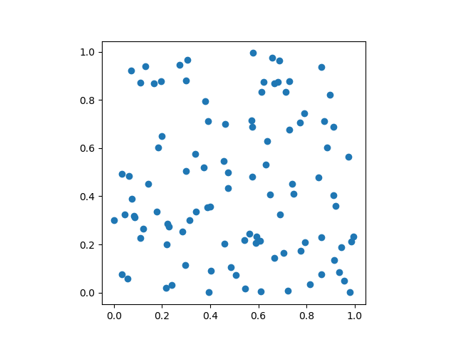
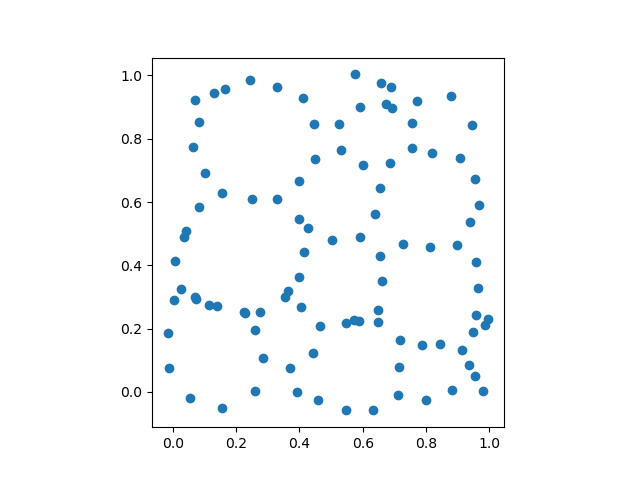

# TDA Updating Persistence
This is a project about updating persistence mentored by Dr. Bradley J.Nelson. Here is the [pre-print](https://arxiv.org/abs/2108.05022).

## Overview
We develop an approach to accelerate persistent homology computations performed on many similar filtered topological spaces which is based on updating associated matrix factorizations. Our approach improves the update scheme of Cohen-Steiner, Edelsbrunner, and Morozov for permutations by additionally handling addition and deletion of cells in a filtered topological space and by processing changes in a single batch.  

## Setup
If you want to run C++ files, please use the following command for cloning submodule as well (since BATS is a submodule)
```
git clone --recursive git@github.com:YuanL12/TDA_Updating_Persistence.git
```

If you only want to run python files, please follow the instruction in https://bats-tda.readthedocs.io/en/latest/installation.html to install it (We recommend Linux OS).


## Get Started 
### Python
The Python API in provided in BATS.py, which should be the easiest way to implement our functions.
We recommend try on our .ipynb files in [demo/Rips Tutorial.ipynb](demo/Rips%20Tutorial.ipynb) for Rips filtration and [ipynb/Levelset Tutorial.ipynb](demo/Levelset%20Tutorial.ipynb) for Levelset filtration. 

#### Compute PH
In short, the general procedure to compute PH is
```Python
# generate a pair-wise distance matrix
D = distance.squareform(distance.pdist(data))
# generate a Rips filtration 
# with the maximun dimension and maximum edge length of a Rips filtration. 
F = bats.LightRipsFiltration(bats.Matrix(D), np.inf, 2)
# compute with F2 coefficents
R = bats.reduce(F, bats.F2())
```
The above PH computation takes 0.73 seconds, while  
if we have another Filtration and hope to update persistence, then using 
```Python
# Consturct another Filtration with different data
D2 = distance.squareform(distance.pdist(data2))
F2 = bats.LightRipsFiltration(bats.Matrix(D2), np.inf, 2)

# update persistence on old one
update_info = bats.UpdateInfoLightFiltration(F, F2)
R.update_filtration_general(update_info)
```
would take 0.28 seconds. You can also check [ipynb/Rips Radius.ipynb](ipynb/Rips%20Radius.ipynb)for detailed comparsion of time.

#### Optimization with PH
If you are interested in optimization with persistent homology, as mentioned in
 **A Topology Layer for Machine Learning**, [arxiv:1905.12200](https://arxiv.org/abs/1905.12200)
 first, we also provide a faster implementation with BATS.py in [demo/py/opt_rips_enc/opt_rips_enclosing_radius.py](demo/py/opt_rips_enc/opt_rips_enclosing_radius.py) and a combination with Pytorch in [develop/BATS_hole.ipynb](develop/BATS_hole.ipynb).


<table><tr>
<td>  <p align = "center">
before
</p> </td> 
<td>  <p align = "center">
after
</p> </td>
</tr></table>

There is also a gif to show the optimization process:


### C++
In order to see how to compute PH, go to [demo/cpp/persistence_demo.cpp](demo/cpp/persistence_demo.cpp), and then 
```Terminal
make persistence_demo.out
```

, this should create a file called "persistence_demo.out". Try running it.
``` Terminal
./persistence_demo.out
```

If you want to update on Rips Filtration then go to [demo/cpp/update_rips.cpp](demo/cpp/update_rips.cpp) and lower star Filtration in [demo/cpp/update_lower_star.cpp](demo/cpp/update_rips.cpp).

### datasets
We appreciate the datasets provided on the internet, but due the file sizes, we are unable to upload them fully on Github. We list the sources of them below, if you want to try on real-world datasets:

1. The Stanford 3D Scanning Rep ository. http://graphics.stanford.edu/data/3Dscanrep
2. Volvis rep ository (archived). https://web.archive.org/web/20150307144939/http://volvis.org/
3. Datasets used in `A Roadmap for the Computation of Persistent Homology': https://github.com/n-otter/PH-roadmap/tree/master/data_sets (Otter, N., Porter, M. A., Tillmann, U., Grindrod, P., and Harrington, H. A. A roadmap for the computation of p ersistent homology. EPJ Data Science 6, 1 (2017))

## BATS(C++) Introduction
BATS is a git submodule, which includes C++ implementations of computational topology. Since BATS.py only provides an API with functions defined in C++, if you want to develop it or have a deep understand of it, then read this section. For an algorithm analysis of reduction algorithm, you can see [demo/cpp/intro.md](demo/cpp/intro.md).

### Matrix (Optional)
In order to create a matrix, go to [demo/cpp/matrix_demo.cpp](demo/cpp/matrix_demo.cpp) to see the implementation of matrices.


### Persistence homology
Standard process for computing PH
```C++ 
 auto F = bats::Filtration(X, vals); // Build a Filtration
 auto C = bats::Chain(F, FT()); //Build a Filtered Chain Complex
 auto R = bats::Reduce(C); //Build a Reduced Filtered Chain Complex
```

Now you are able to see the persistence pairs by:

```C++
std::cout << "\npersistence pair at dim 0" << std::endl;
for (auto& p: R.persistence_pairs(0)) 
    {std::cout << p.str() << std::endl;
}

std::cout << "\npersistence pair at dim 1" << std::endl;
for (auto& p: R.persistence_pairs(1)) {
    std::cout << p.str() << std::endl;
}
```
, and it will return 
```
persistence pair at dim 0
0 : (2,inf) <0,-1>
0 : (3,3) <1,0>
0 : (5,5) <2,1>

persistence pair at dim 1
1 : (5,6) <2,0>
```
Each line is an n-dimensional persistence pair in the format of 
```
<homology dimension> : (<birth filtration value>, <death filtration value>) <birth index of n-simplex, death index of (n+1)-simplex>
```
, where birth_index and death_index are generally the index of a simplex at dimension k(creates the homology) and the index of a simplex at dimension k+1(destroies the homology). 

### Updating persistence
There are several options to update.
#### Fixed-sized filtration 
Option 1. Updating filtration value in FilteredChainComplex 
i.e., updating C directly by 
```C++
 C.update_filtration(vals);
 R = bats::Reduce(C);
 R.print_summary()
```

Option 2. Updating filtration value in ReducedFilteredChainComplex 
i.e., updating R by
```C++
 R.update_filtration(vals);
 R.print_summary();
```

#### General filtration
If the complex of a filtration has been sorted by its filration values (which is the normal case), then, as shown in [demo/cpp/update_rips.cpp](demo/cpp/update_rips.cpp),

```C++
// update Filtered Chain Complex
auto UI = bats::Update_info(F_X, F_Y); // build information
FCC.update_filtration_general(UI);
```
or 
```C++
// update Reduced Filtered Chain Complex
auto UI = bats::Update_info(F_X, F_Y); // build information
RFCC.update_filtration_general(UI);
```

For a general filtration whose complex is built in an arbitrary order, then you can also check `demo/cpp/update_general.cpp`.

